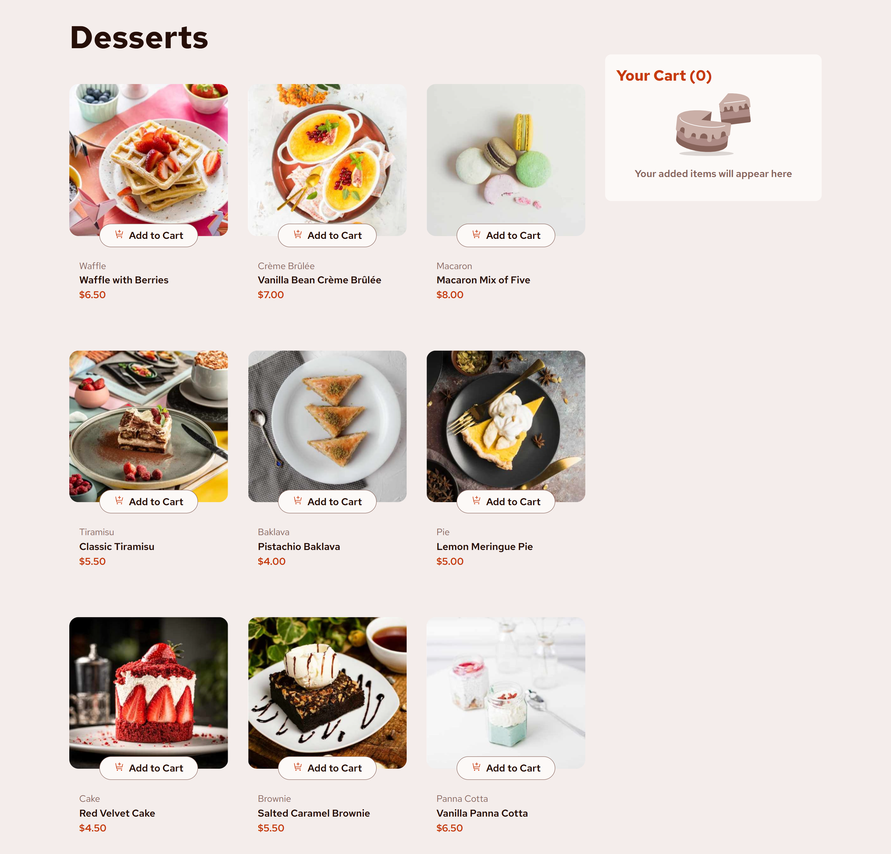

# Frontend Mentor - Product list with cart solution

This is a solution to the [Product list with cart challenge on Frontend Mentor](https://www.frontendmentor.io/challenges/product-list-with-cart-5MmqLVAp_d). Frontend Mentor challenges help you improve your coding skills by building realistic projects. 

## Table of contents

- [Overview](#overview)
  - [The challenge](#the-challenge)
  - [Screenshot](#screenshot)
  - [Links](#links)
  - [Built with](#built-with)
  - [What I learned](#what-i-learned)
  - [Continued development](#continued-development)
  - [Useful resources](#useful-resources)

## Overview

A Product List with Cart built using React.

### The challenge

Users should be able to:

- Add items to the cart and remove them
- Increase/decrease the number of items in the cart
- See an order confirmation modal when they click "Confirm Order"
- Reset their selections when they click "Start New Order"
- View the optimal layout for the interface depending on their device's screen size
- See hover and focus states for all interactive elements on the page

### Screenshot

### Links

- Solution URL: [solution](https://github.com/remainhumble/product-list-with-cart)
- Live Site URL: [live site](https://remainhumble.github.io/product-list-with-cart/)

### Built with

- Semantic HTML5 markup
- CSS custom properties
- Flexbox
- Mobile-first workflow
- [React](https://reactjs.org/) - JS library

### What I learned

- Implemented state management with React hooks (useState) to manage cart items and quantities
- Built reusable components for product cards and cart functionality
- Used CSS Grid and Flexbox for responsive layout across different screen sizes
- Managed modal visibility and order confirmation flow with conditional rendering
- Learned how to handle event listeners for add/remove cart operations and form submissions

### Continued development

I want to focus more on state management. a core concept of any JavaScript framework and probably its most powerful feature. By having the component automatically respond to changes in state, you don’t need to worry about destroying and creating DOM nodes yourself, allowing you to concentrate on the UI itself.

### Useful resources

- [Passing Data Deeply with Context](https://react.dev/learn/passing-data-deeply-with-context) - Context lets the parent component make some information available to any component in the tree below it—no matter how deep—without passing it explicitly through props.

